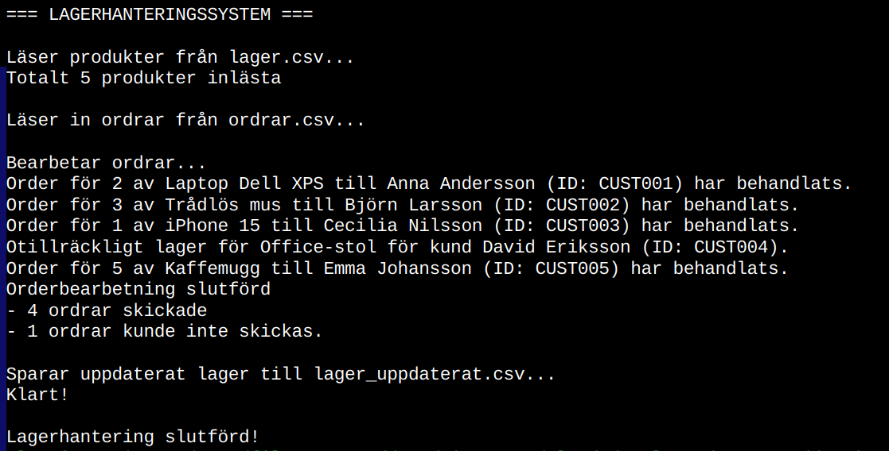

# assignment-oop-81clafra - Claes Fransson

**Valt alternativ:** Lagerhanteringssystem

## Projektbeskrivning

_Skriv en kort beskrivning (2-3 meningar) om vilket alternativ du har valt och vad ditt program gör._

## Screenshot

_Lägg till minst en skärmbild som visar ditt program i aktion. Detta gör ditt projekt mer intressant och hjälper andra att förstå vad det gör._


_Kort beskrivning av vad som visas i bilden_

### Så här lägger du till screenshots:

1. Ta en skärmbild när ditt program körs (använd `Print Screen` eller `Snipping Tool`)
2. Spara bilden som `screenshot.png` i din projektmapp
3. Committa och pusha bilden till GitHub tillsammans med din kod
4. Bilden visas automatiskt i din README

_Tips: Du kan lägga till flera bilder för att visa olika delar av programmet, t.ex. spelstart, gameplay och slutskärm._

## Hur man startar programmet

### Förutsättningar

- .NET 9.0 eller senare
- En av följande utvecklingsmiljöer: Visual Studio, JetBrains Rider, Visual Studio Code, eller terminal/kommandotolk

### Klona projektet

```bash
git clone https://github.com/orgs/Campus-Molndal-CLO25/repositories/assignment-oop-81clafra
cd assignment-oop-81clafra
```

### Starta programmet

#### Visual Studio

1. Öppna `assignment-oop-81clafra.sln` eller projektmappen
2. Tryck `F5` eller klicka på "Start" (grön triangel)

#### JetBrains Rider

1. Öppna projektmappen genom "File → Open"
2. Tryck `Ctrl+F5` eller klicka på "Run" (grön triangel)

#### Visual Studio Code

1. Öppna projektmappen: `code .`
2. Installera C# Dev Kit-tillägget om det saknas
3. Tryck `F5` eller använd "Run → Start Debugging"

#### Terminal/Kommandotolk

```bash
dotnet run
```

Placera filen för lagersdata, `lager.csv`, och filen med ordrar, `ordrar.csv`, i samma katalog som 
du kör programmet. 

## Hur man använder programmet

_Beskriv kortfattat hur användaren interagerar med ditt program. Ge konkreta exempel på kommandon eller val._

**Exempel:**

- För att skicka en sond: Skriv koordinater som "A5" eller "B7"
- För att gå mellan rum: Skriv "gå norr" eller "syd"
- Programmet läser automatiskt CSV-filer från projektmappen

## Funktioner

_Lista de huvudsakliga funktionerna ditt program har._

### Grundfunktioner

- [ ] [Funktion 1]
- [ ] [Funktion 2]
- [ ] [Funktion 3]

### Extra funktioner (för VG)

- [ ] [VG-funktion om implementerad]

## Projektstruktur

```
assignment-oop-81clafra/
├── OOPAssignment/
│   ├── Program.cs          # Huvudprogram
│   ├── InventoryManager.cs # Klasser
│   ├── Order.cs
│   ├── Product.cs
│   ├── lager.csv           # Datafiler
│   └── ordrar.csv
├── README.md               # Denna fil
├── reflection.md           # Reflektion över projektet
└── LICENSE
```

## Teknisk information

- **Programmeringsspråk:** C#
- **Framework:** .NET 9.0
- **Utvecklingsmiljö:** [Visual Studio Code + TabbyML / Fedora Linux]

## Spara projektet för framtiden

När du är klar och nöjd med ditt projekt, rekommenderas du att "forka" (kopiera) det till ditt privata GitHub-konto. Detta skapar en permanent kopia som du kan visa för framtida arbetsgivare som en del av din portfolio.

### Så här forkar du projektet:

1. **Gå till ditt projekt** på GitHub: https://github.com/orgs/Campus-Molndal-CLO25/repositories/assignment-oop-[ditt-username]

2. **Klicka på "Fork"** (längst upp till höger på sidan)

3. **Välj ditt privata konto** som destination för fork:en

4. **Uppdatera beskrivningen** i din fork:

   - Gå till din fork: `https://github.com/[ditt-privata-username]/assignment-oop-[ditt-username]`
   - Klicka på kugghjulet (Settings)
   - Lägg till en beskrivning som: "C# OOP project - Ocean research game built during studies at Campus Mölndal"
   - Lägg till topics/tags som: `csharp`, `oop`, `console-game`, `dotnet`

5. **Gör en sista uppdatering** av README.md i din fork och ändra länken under "GitHub Repository" till din nya fork

### Varför är detta viktigt?

- **Portfolio:** Visar dina programmeringsfärdigheter för potentiella arbetsgivare
- **Permanent kopia:** Skolans repositories kan tas bort efter kursen
- **Progression:** Du kan se tillbaka på ditt arbete och hur du utvecklats
- **Referens:** Användbart att ha tillgång till din egen kod för framtida projekt

## Länkar

- **GitHub Repository:** https://github.com/orgs/Campus-Molndal-CLO25/repositories/assignment-oop-[ditt-username]
- **Din privata fork:** (uppdatera denna länk efter att du forkat)
- **Kurshemsida:** [länk om relevant]

---

_Skapad som del av kursen "Grundläggande objektorienterad programmering i C#" vid Yrkeshögskolan Campus Mölndal._
